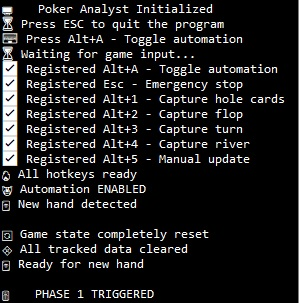
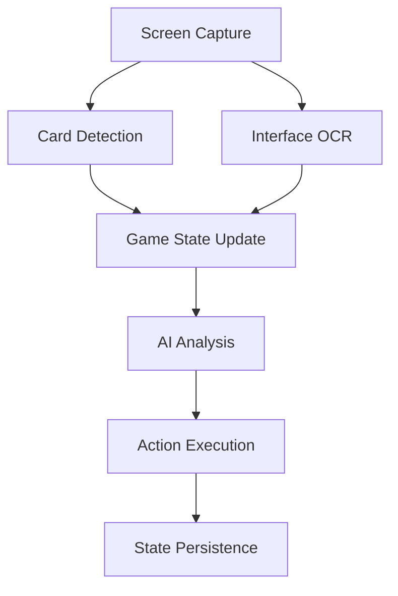

#  🂡 Ace Autopilot - Self-Playing Poker AI System 🤖

*Automated poker system integrating real-time vision processing, game theory optimization, and tactical automation.*

[](https://opencv.org/)
[](https://deepseek.com/)
[](https://github.com/vikhyat/moondream)
[](https://pyautogui.readthedocs.io/)
[](https://github.com/tesseract-ocr/tesseract)
[](https://flask.palletsprojects.com/)

## 🌟 Features

- 🖥️ **Real-Time Screen Analysis**  
  Computer vision powered by OpenCV + Tesseract OCR + Moondream-2B
- 🧠 **AI Decision Engine**  
  DeepSeek API integration with advanced game theory analysis
- 🕹️ **Smart Automation**  
  Phase-aware automation with manual override (Alt+1 to Alt+5)
- 📊 **Dynamic Overlay GUI**  
  Live game state visualization and decision logs
- 🔄 **Multi-Phase Tracking**  
  Handles all poker phases: Pre-flop → Flop → Turn → River

## 🖱️ Overlay Controls


| Hotkey    | Action                          |
|-----------|---------------------------------|
| `Alt+1`   | Capture hole cards (Pre-flop)   |
| `Alt+2`   | Analyze Flop                    |
| `Alt+3`   | Analyze Turn                    |
| `Alt+4`   | Analyze River                   |
| `Alt+5`   | Manual State Update             |
| `Alt+A`   | Toggle Auto-Play                |
| `Esc`     | Emergency Stop                  |

## 🛠️ Tech Stack & Libraries

### Core Components

| Category               | Technologies & Components                                                                 |
|------------------------|-------------------------------------------------------------------------------------------|
| **Computer Vision**    | OpenCV, Moondream-2b-int8.mf vision model, MSS screen capture, Image processing pipelines  |
| **AI Integration**     | DeepSeek API, JSON processing, Probability calculations, Hand range analysis              |
| **Automation**         | PyAutoGUI, Keyboard input handling, Multi-threading, Phase detection algorithms           |
| **OCR & Text**         | Tesseract OCR, Pytesseract, Text normalization, Action pattern matching                   |
| **GUI & Overlay**      | Tkinter overlay, Real-time logging, Screen coordinates management                         |
| **Game State**         | JSON state management, Phase tracking, Player action history, Fold detection              |
| **APIs & Services**    | DeepSeek API, Environment configs, Rate limiting, Error handling                          |

## 🚀 Quick Start

### 📥 Installation
```bash
git clone https://github.com/newMeta98/ace-autopilot-poker-ai.git
cd ai-poker-master
pip install -r requirements.txt
```

## 🔧 Requirements
Python 3.9+

NVIDIA GPU (Recommended for vision processing. I don't have it and it works, but slower)

Tesseract OCR

### Key Dependencies

```txt
opencv-python          # Computer vision processing
pytesseract            # OCR text extraction
pyautogui              # Mouse/keyboard automation
moondream              # Vision model for card recognition
keyboard               # Hotkey detection
mss                    # Fast screen capturing
pillow                 # Image processing
numpy                  # Array operations
python-dotenv          # Environment management
openai                 # For deepseek API client
```

## Vision Model Details

Go to Moondream official page or github page to learn how to download and setup moondream.
Moondream-2B-INT8
Optimized 2B parameter vision-language model quantized to INT8
Specialized for real-time card recognition and symbol detection
Average inference time: 320ms per card (on RTX 3060)

### 🖥️ Hardware Requirements
NVIDIA GPU (Recommended for real-time vision processing. I don't have it and it works, but slower. Im on AMD Ryzen 5 5600G)

8GB VRAM for optimal model performance (I have 16GB RAM and I was fine useing CPU its just slower)

## 🔄 Workflow Architecture



## ⚙️ Configuration
### 🗺️ Coordinate Setup
```python

# app.py
COORDINATES = {
    "your_card1": {"top": 610, "left": 374, "width": 38, "height": 48},
    "table_card1": {"top": 423, "left": 213, "width": 28, "height": 47},
    # ... other regions
}

```
### ⚠️ Adjust coordinates according to your screen resolution

## 🔌 API Setup

**Get DeepSeek API Key**: deepseek.com

Create .env file:

```ini

DEEPSEEK_API_KEY="your_api_key_here"
```

**Add poker knowledge base**:

```txt

knowledge/
└── knowledge.txt  # Strategic guidelines

```

## 🤝 Contributing

**We welcome contributions! Please follow these steps**:

Fork the repository

Create your feature branch (git checkout -b feature/AmazingFeature)

Commit your changes (git commit -m 'Add some AmazingFeature')

Push to the branch (git push origin feature/AmazingFeature)

Open a Pull Request

## 📜 License
Distributed under the MIT License. See LICENSE for more information.

## 🙏 Acknowledgments
Moondream Vision Model

DeepSeek AI API

OpenCV Community

Tesseract OCR Team

**Tip: 💡 Always test in play-money mode before real money use!**
*This project is for educational purposes only. It was never tested with real money. Use at your own risk.*